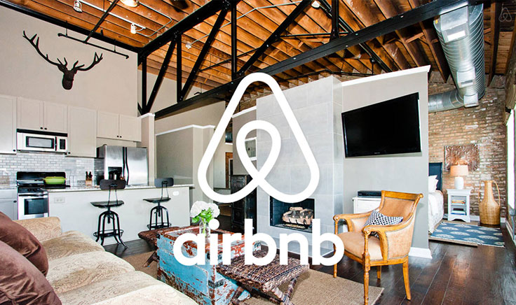

# Airbnb Exploration - Find Your Ideal Home

[Explore the Airbnb Exploration App](https://yuyaowang.shinyapps.io/airbnb_app/)


## Overview

The **Airbnb Exploration App** is an interactive tool designed to help users discover the perfect Airbnb property based on various customizable filters. Developed using **R Shiny**, this app integrates dynamic user interface elements and server-side logic to provide real-time data interaction and visualization. Whether you're searching by location, price range, or property type, this app offers a comprehensive solution to finding your ideal Airbnb stay.



## Features

- **Dynamic Search Filters:** Customize your search based on location, price range, property type, and more.
- **Interactive Maps:** Explore rental properties geographically with an intuitive map interface.
- **Real-Time Data Visualization:** Visualize booking trends and other relevant data with interactive charts powered by `ggplot2` and `plotly`.
- **Scalable Performance:** Efficient handling of large Airbnb datasets using `dplyr` and `data.table` for optimized server-side computations.
  

## Installation

### Prerequisites

Ensure you have the following installed:

- [R](https://cran.r-project.org/)
- [RStudio](https://rstudio.com/)
- Shiny package: `install.packages("shiny")`
- Additional packages: `ggplot2`, `plotly`, `dplyr`, `data.table`, `leaflet`

### Setup

1. Clone this repository to your local machine:
   ```bash
   git clone https://github.com/yourusername/airbnb_exploration_app.git
   ```
2. Open the project in RStudio.

3. Install the required packages by running:
   ```r
   install.packages(c("shiny", "ggplot2", "plotly", "dplyr", "data.table", "leaflet"))
   ```

4. Run the Shiny app:
   ```r
   shiny::runApp('path_to_your_app_directory')
   ```

## Usage

The app provides a user-friendly interface to explore Airbnb listings with several filter options:

1. **Location:** Use the map to select a location and filter properties in that area.
2. **Price Range:** Adjust the sliders to set your desired price range.
3. **Property Type:** Choose between options like apartments, houses, etc.
4. **Booking Trends:** Visualize booking trends over time using interactive charts.

## Data

The app leverages Airbnb data which can be sourced from public datasets. Ensure that your data is formatted correctly to integrate seamlessly with the app.

## Future Enhancements

- **Machine Learning Integration:** Implement predictive models to suggest optimal booking times based on historical data.
- **User Profile Customization:** Allow users to save and customize their search preferences for a personalized experience.
- **Expanded Filters:** Introduce additional filters such as amenities, host rating, and guest reviews.

## Acknowledgments

This project was developed using the following tools:

- **R Shiny**: For creating the interactive web application.
- **ggplot2 & plotly**: For data visualization.
- **leaflet**: For interactive mapping.
- **Airbnb**: For providing a comprehensive platform for short-term rentals.


